<p align="center">
  
</p>

<h1 align="center">CulturePulse</h1>

<p align="center"><strong>Find your scene, not just events.</strong></p>

<p align="center">
  A map-first product for Gen Z micro-scenes — skate meetups, study circles, open mics, creator collabs — with a native Android client, a TypeScript API, background jobs, and a trust &amp; safety admin console. One monorepo. One city that actually feels alive.
</p>

<p align="center">
  
  
  
  
</p>

<p align="center">
  <a href="#quick-start">Quick start</a> ·
  <a href="#product">Product</a> ·
  <a href="#architecture">Architecture</a> ·
  <a href="docs/API.md">API</a> ·
  <a href="docs/DEMO.md">5-minute demo</a> ·
  <a href="docs/SAFETY.md">Safety</a>
</p>

---

## Why this exists

Gen Z already lives in global feeds. What they still can't find is **the room down the street**: a five-person study sprint, a riverfront night roll, an open mic that doesn't require a press kit.

Meetup and Eventbrite optimize for organizations and tickets. CulturePulse optimizes for **tonight**.

| Incumbent assumption | CulturePulse bet |
| --- | --- |
| Events are polished, marketed, ticketed | Pulses are lightweight, hostable in 60 seconds |
| Location is a venue address | Location can be **fuzzy** until you RSVP going |
| Attendance is a public list | Attendance can be **anonymous** |
| Reviews are five stars | Reflections are an emoji + one sentence |
| Communities are Facebook groups | Scenes are followable crews on a map |

This repository is a **portfolio-grade, end-to-end implementation** of that bet — not a Figma dump, not a single CRUD tutorial. You can clone it, run it, RSVP to a live skate pulse in Ahmedabad, hide a reported pin from the admin queue, and read the safety model that makes the map trustworthy.

---

## Product

CulturePulse is three surfaces, one domain language.

| Surface | What a recruiter can actually do |
| --- | --- |
| **Map client** (`web/app`, :5173) | Discover pulses on a dark city map, filter by vibe / access / time, RSVP, follow scenes, host in one form |
| **Admin** (`web/admin-panel`, :5174) | City metrics, moderation queue, tag taxonomy, feature flags by region & cohort |
| **Android** (`apps/android`) | Jetpack Compose map home, pulse detail, host flow, scenes — same object model |

### Map-first discovery

The home screen is not a feed with a map tucked in a tab. **The map is the product.** Pins encode status (pink = live, lime = upcoming). A live pulse can broadcast a last-minute update — "moved 80m south, the north ramp is wet" — and every RSVP hears it.

<p align="center">
  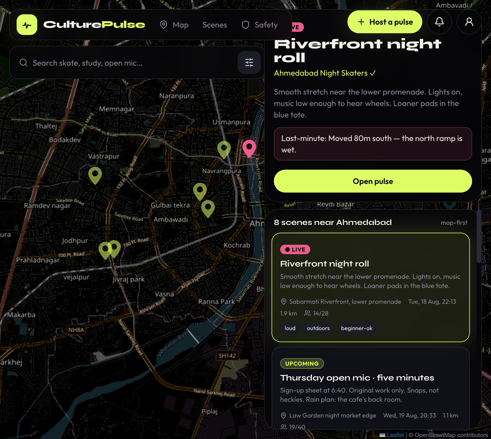
</p>

<p align="center"><em>Live pin on the Sabarmati Riverfront. Eight scenes in radius. Host update already in the peek card.</em></p>

### Pulses, not posters

A pulse is title, time, vibe tags, capacity, safety notes, and a pin. Hosts get templates (study circle, open mic, skate meetup) so creation stays closer to a story than an admin form.

<p align="center">
  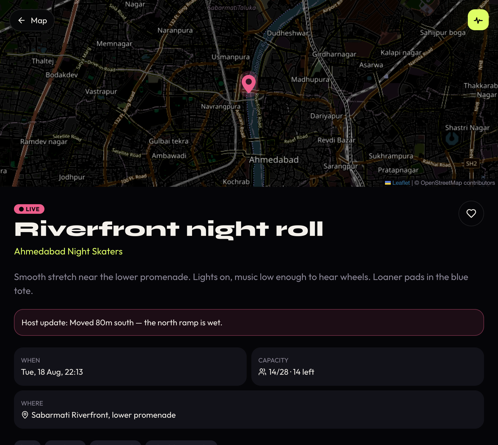
  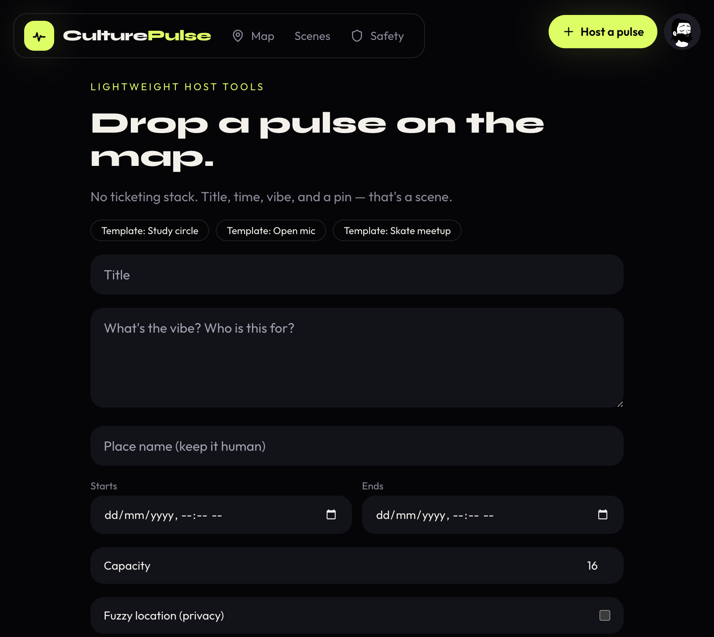
</p>

RSVP states: **going**, **interested**, **anonymous**. Anonymous still occupies a seat. Fuzzy pins resolve to the real coordinate only for going / host — computed on the server, never leaked to a curious map-scroller.

### Scenes as micro-communities

Scenes are the recurring crews. Follow Ahmedabad Night Skaters and the next pulse is a notification, not an accident.

<p align="center">
  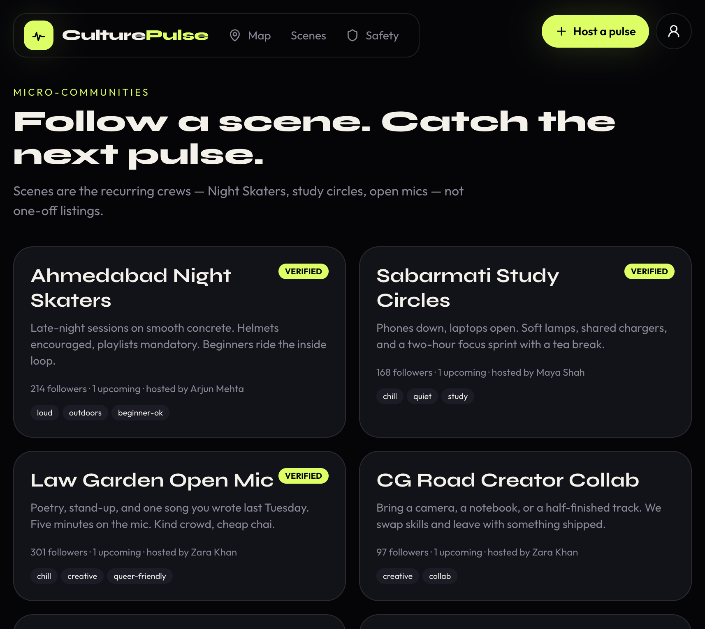
</p>

### Safety is a feature, not a footer

<p align="center">
  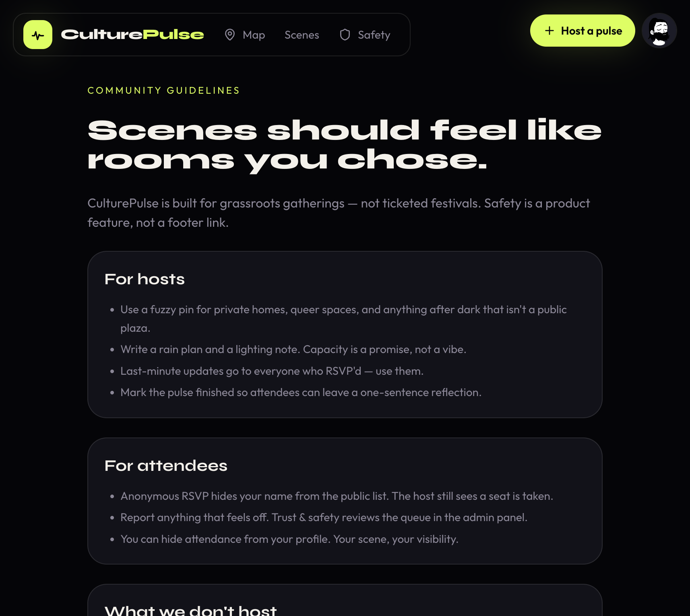
</p>

Privacy controls, anonymous RSVP, report + block, and host rain-plans are specified in [docs/SAFETY.md](docs/SAFETY.md) and enforced in `services/api`.

### Pulse Control (admin)

Ops gets the same visual language: lime on ink, no enterprise beige.

<p align="center">
  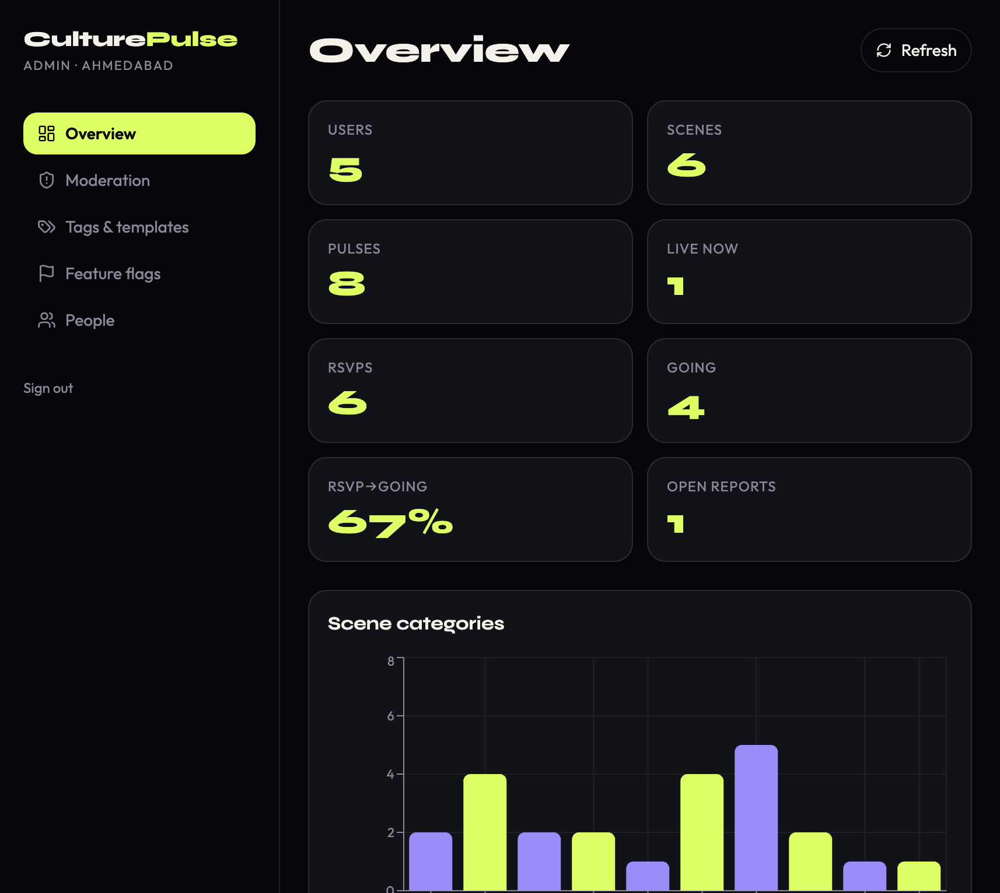
</p>

<p align="center">
  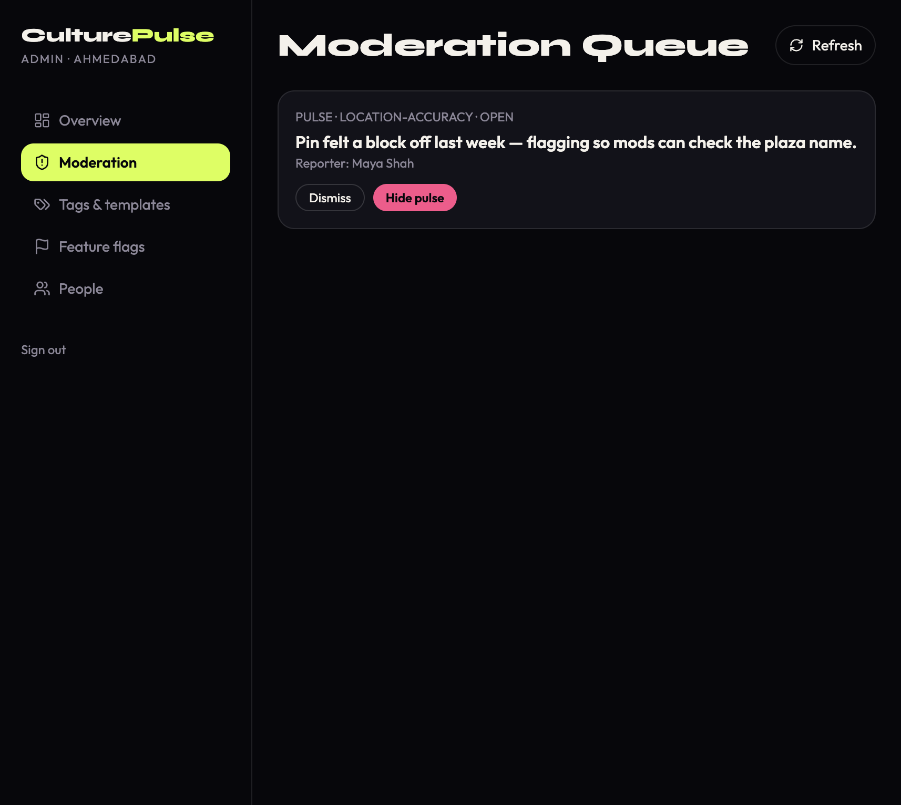
  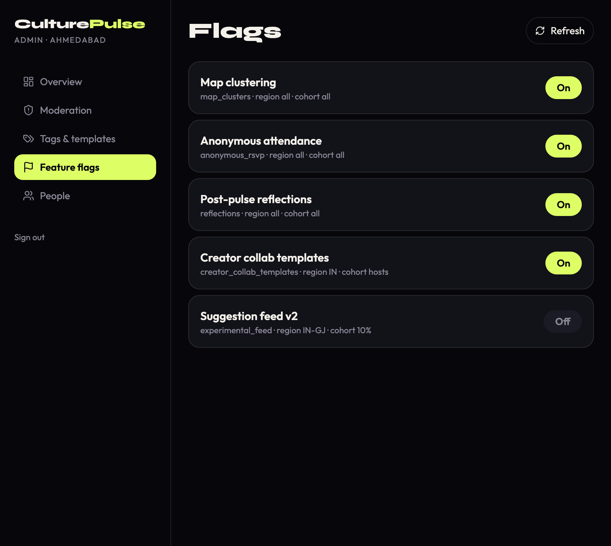
</p>

Moderation can dismiss a report or **hide the pulse**. Feature flags ship by region (`IN`, `IN-GJ`) and cohort (`hosts`, `10%`) — the same knob you'd use in a real launch.

### Android

Kotlin + Jetpack Compose. Demo pulses ship in-process so Android Studio is enough; Retrofit is wired to `http://10.0.2.2:4000` for the live API.

<p align="center">
  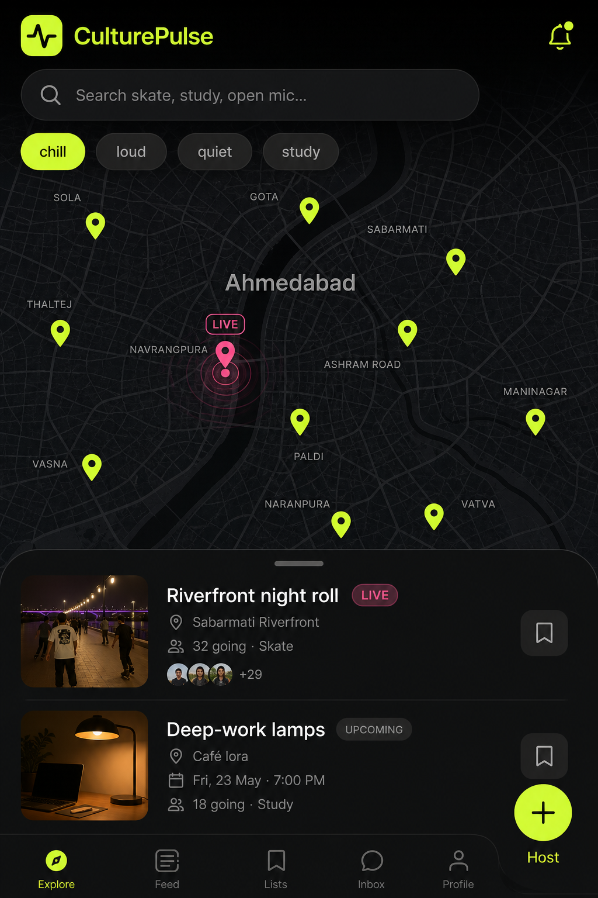
  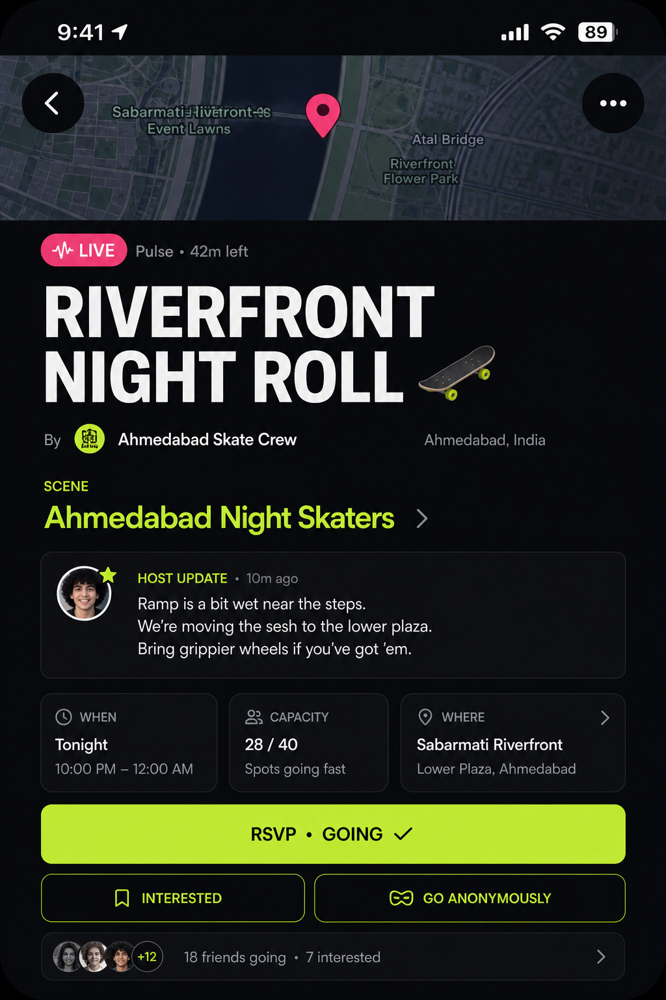
</p>

---

## Architecture

```text
CulturePulse/
├── apps/android/            # Kotlin, Compose, Navigation, ViewModel, Retrofit
├── services/api/            # Express + TypeScript + JWT + Haversine geo
├── services/jobs/           # Expire pulses, 2-hour RSVP reminders
├── web/app/                 # Map-first React client (Vite, Leaflet)
├── web/admin-panel/         # Moderation + analytics (Recharts)
└── docs/                    # Product spec, API, safety, demo script
```

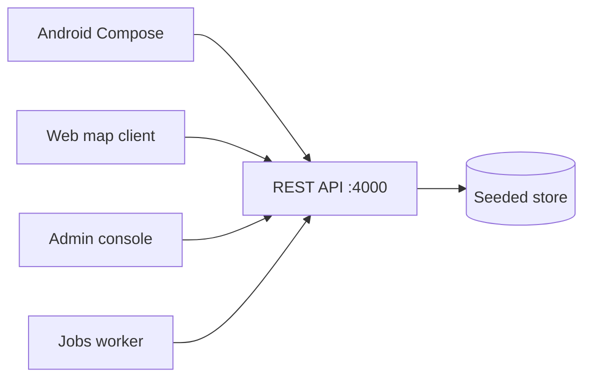

The store is a **deliberate seam**. Today it is a JSON document so `npm run dev` has zero Docker, zero Postgres, zero excuses. The route contracts in [docs/API.md](docs/API.md) are the ones you'd keep when swapping in PostgreSQL + PostGIS.

Deeper write-up: [docs/ARCHITECTURE.md](docs/ARCHITECTURE.md). The original product brief: [docs/product-culturepulse.md](docs/product-culturepulse.md).

### Request path worth reading

1. `GET /pulses?lat=&lng=&radiusKm=&vibe=quiet,study&window=today`
2. Haversine filter + vibe/access + time window
3. Live pulses sort first, then distance
4. `sanitizePulse()` jitters coordinates unless the viewer is going / host
5. Jobs tick `upcoming → live → finished` off `startAt` / `endAt`

Recommendations (`GET /pulses/recommended`) score **past RSVP tags + followed scenes + proximity + a live boost**. It is honest about being v1. It is not a fake "AI layer".

---

## Tech stack

| Layer | Choice | Why |
| --- | --- | --- |
| Android | Kotlin, Jetpack Compose, Navigation, ViewModel | The spec's daily driver |
| API | Node 22, Express, TypeScript, Zod, JWT | Typed contracts, fast demo, easy to hire against |
| Geo | Haversine now / PostGIS later | Query params stay stable |
| Web | React 19, Vite, Tailwind, Leaflet | Recruiter-runnable map without an emulator |
| Admin | React + Recharts | Trust & safety is a product surface |
| Jobs | 30s HTTP worker | Same contract as SQS + FCM later |
| Dev | npm workspaces, Docker Compose, GitHub Actions | One command, one pipeline |

---

## Quick start

**Requires Node 22+.**

```bash
git clone https://github.com/abstractednick/CulturePulse.git
cd CulturePulse
npm install
npm run dev
```

| Surface | URL |
| --- | --- |
| Map client | http://localhost:5173 |
| Admin console | http://localhost:5174 |
| API health | http://localhost:4000/health |

Demo password for every account: `pulse123`

| Email | Role | Use it to |
| --- | --- | --- |
| `maya@culturepulse.app` | member | RSVP, anonymous attendance, reflections |
| `arjun@culturepulse.app` | host | Night Skaters, last-minute updates |
| `zara@culturepulse.app` | host | Open mic, book club, collabs |
| `admin@culturepulse.app` | admin | Pulse Control at :5174 |

Walkthrough with talking points: **[docs/DEMO.md](docs/DEMO.md)**.

### Docker

```bash
docker compose up --build
```

### Android

Open `apps/android` in Android Studio, copy `local.properties.example` → `local.properties`, run on API 26+.

---

## API snapshot

```http
POST /auth/login
GET  /pulses?lat=23.0225&lng=72.5714&radiusKm=12&vibe=chill&window=now
POST /pulses/:id/rsvp          { "status": "going" | "interested" | "anonymous" }
POST /pulses/:id/reflections   { "emoji": "🫶", "sentence": "...", "safetyRating": 5 }
GET  /admin/overview
PATCH /admin/reports/:id       { "status": "resolved", "action": "hide-pulse" }
```

Full table: [docs/API.md](docs/API.md).

Auth screen (one click into a persona):

<p align="center">
  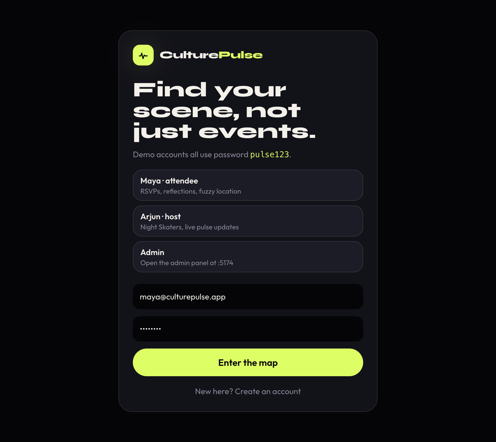
</p>

---

## What I would ship next

This is the honest backlog — written so a hiring manager can see product judgment, not just ticket velocity.

1. **PostGIS + clustering** — replace Haversine once a city has thousands of pulses.
2. **FCM on the jobs worker** — the notification objects already exist; they need a push adapter.
3. **Phone OTP + Google** — JWT shape stays; identity adapters swap.
4. **Maps SDK on Android** — Compose map is the offline-reviewable stand-in; production wants the platform map with the same pin language.
5. **Rate limits + Argon2id** — before any real user ever types a password here.

---

## Documentation map

| Doc | Why it exists |
| --- | --- |
| [docs/product-culturepulse.md](docs/product-culturepulse.md) | Source of truth for the product |
| [docs/ARCHITECTURE.md](docs/ARCHITECTURE.md) | Monorepo rationale and production seams |
| [docs/API.md](docs/API.md) | Every route a client needs |
| [docs/DEMO.md](docs/DEMO.md) | Five-minute recruiter script |
| [docs/SAFETY.md](docs/SAFETY.md) | Privacy rules the API actually enforces |
| [apps/android/README.md](apps/android/README.md) | Compose client |
| [CONTRIBUTING.md](CONTRIBUTING.md) | How to add a vibe tag without breaking the language |

---

## License

MIT. Built as a public portfolio piece by [abstractednick](https://github.com/abstractednick). Named **CulturePulse** on purpose: the pulse is the unit of culture that fits on a map.
