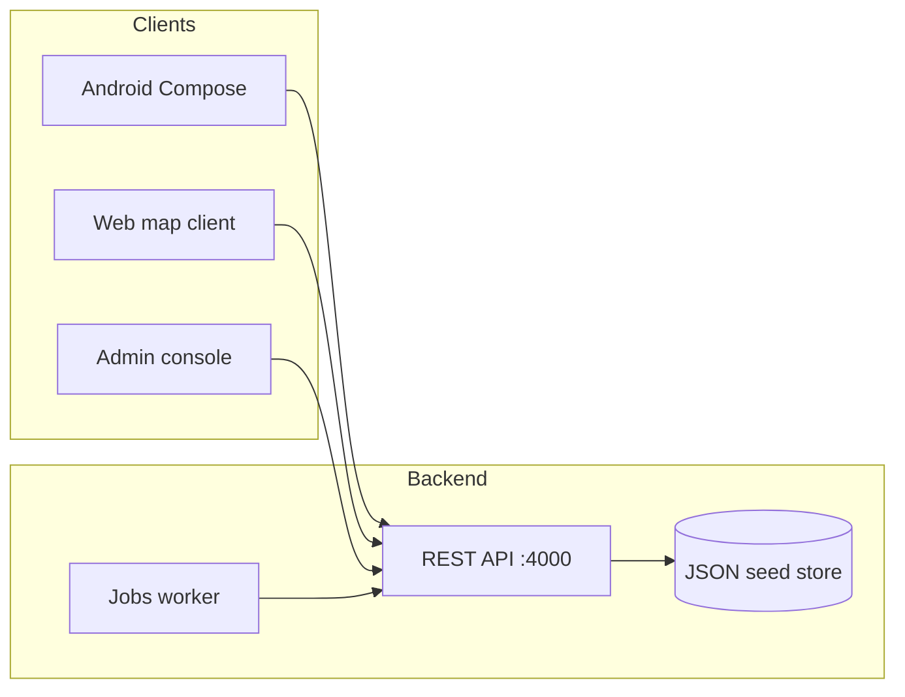

# Architecture

CulturePulse is a **single-root monorepo**. Mobile, API, jobs, and admin share one product language (pulses, scenes, vibes) while using the stack each surface deserves.

```text
CulturePulse/
├── apps/android/          Kotlin + Jetpack Compose client
├── services/api/          TypeScript REST API (Express, JWT, geo)
├── services/jobs/         Background tick: expiry, reminders
├── web/app/               Map-first web client (Vite + React + Leaflet)
├── web/admin-panel/       Moderation + analytics console
└── docs/                  Product, API, safety, demo scripts
```

## Why this shape

Recruiters (and future teammates) should be able to **run the story of the product in a browser** without Android Studio, while the native app still exists as the intended daily driver. The web client is not a watered-down marketing site — it is the same object model as Android: pulses, RSVPs, fuzzy pins, reflections, host updates.



## Domain language

| Word | Meaning |
| --- | --- |
| **Pulse** | A lightweight pop-up gathering (not a ticketed event). |
| **Scene** | A recurring micro-community that hosts pulses. |
| **Vibe tags** | chill / loud / study / queer-friendly / sober / … |
| **Fuzzy pin** | Approximate map coordinate until the viewer RSVPs **going**. |
| **Reflection** | Emoji + one sentence + safety rating after a pulse ends. |

## API module

`services/api` is a **stateless HTTP service** with an in-process store so `npm run dev` has zero infrastructure. The store is the seam: swap `services/api/src/data/store.ts` for PostgreSQL + PostGIS without changing route contracts.

Responsibilities:

- JWT auth (email; OAuth is the next adapter)
- Geo search (Haversine, radius, vibe/access/time windows)
- Pulse CRUD, RSVP (going / interested / anonymous)
- Scene follow graph
- Recommendation score = past tags + followed scenes + proximity + live boost
- Moderation reports + feature flags
- Internal job endpoints for expiry and reminders

## Jobs module

`services/jobs` polls the API every 30s:

1. **Expire** — upcoming → live → finished from `startAt` / `endAt`
2. **Remind** — notify RSVPs inside a 2-hour horizon

In production this becomes a queue (SQS / Cloud Tasks) + FCM. The contract is already HTTP.

## Web map client

Leaflet + Carto dark tiles. Filters are query-params on `GET /pulses`. Fuzzy coordinates are resolved **server-side** so the client never sees a precise home address until RSVP policy allows it.

## Admin console

Ops surface for:

- city pulse metrics and tag mix
- reported content queue (dismiss / hide)
- vibe & accessibility taxonomy
- feature flags by region/cohort
- demo seed reset

## Android

Jetpack Compose, Navigation, ViewModel. Demo pulses ship in-process so the APK is reviewable offline. `ApiModule` is wired to `http://10.0.2.2:4000` for emulator + live API.

## What would change for production

| Today (portfolio) | Production |
| --- | --- |
| JSON file store | PostgreSQL + PostGIS |
| Demo passwords | OAuth + phone OTP + hashed secrets |
| Leaflet OSM | Mapbox / Google Maps with clustering |
| In-process jobs | Worker + FCM |
| Single city seed (Ahmedabad) | Multi-city + region flags |

The product spec that drove this layout lives in [product-culturepulse.md](./product-culturepulse.md).
